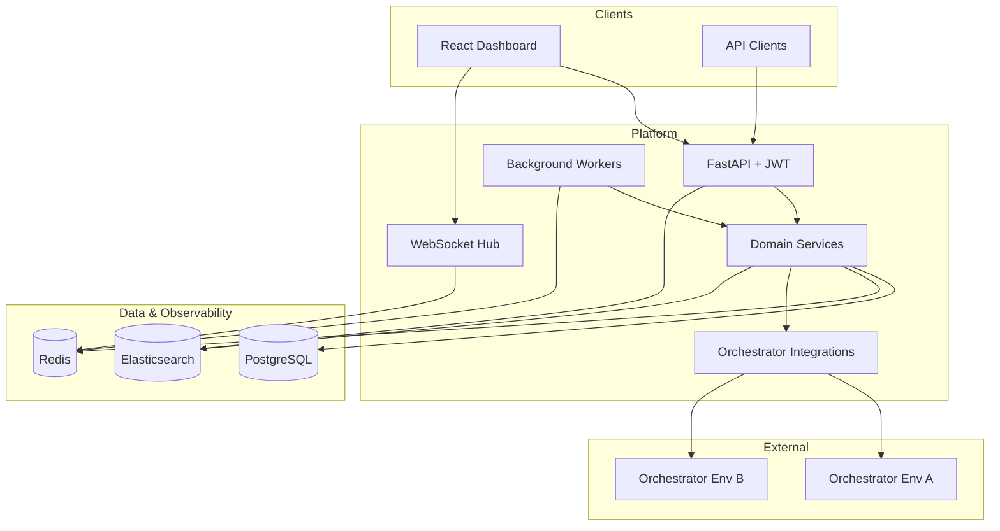

# Architecture

## Overview

The platform follows a **modular monolith** backend with clear domain boundaries, a **BFF-friendly** REST + WebSocket API, and a **feature-sliced** React frontend. External systems: UiPath Orchestrator (per environment), PostgreSQL (system of record), Redis (cache, pub/sub, Celery broker), Elasticsearch (logs + searchable audit), and optional object storage for exports.

## Layering (backend)

| Layer | Responsibility |
|-------|----------------|
| **API** (`app/api/`) | HTTP routing, request validation, auth dependencies, response mapping |
| **Schemas** (`app/schemas/`) | Pydantic DTOs — never leak ORM models to clients |
| **Services** (`app/services/`) | Business logic, orchestration, transactions, SLA evaluation |
| **Repositories** (`app/repositories/`) | Data access, query composition (optional; use when queries grow complex) |
| **Models** (`app/models/`) | SQLAlchemy ORM entities |
| **Integrations** (`app/integrations/`) | UiPath Orchestrator HTTP clients, webhooks, rate limiting |
| **Workers** (`app/workers/`) | Scheduled sync, alert dispatch, aggregation |
| **Core** (`app/core/`) | Config, security, logging, DB session, exceptions |

**Rule:** API handlers call services only. Services call repositories and integrations. No Orchestrator calls from API routes directly.

## Domain modules

| Domain | Purpose |
|--------|---------|
| **auth** | JWT issue/refresh, login, password policies |
| **users / rbac** | Users, roles, permissions, environment-scoped grants |
| **environments** | Orchestrator connection profiles (URL, tenant, secrets ref) |
| **orchestrator** | Proxy/sync: folders, processes, assets metadata |
| **queues** | Queue depth, SLA, transaction trends |
| **jobs** | Job runs, states, failures, duration analytics |
| **robots** | Machine/robot status, licenses, connectivity |
| **ai_workflows** | Agentic/AI pipeline runs, LLM step metrics (extensible) |
| **dashboards** | Aggregated KPIs, saved views |
| **sla** | Threshold rules, breach detection, notification channels |
| **audit** | Immutable audit trail (DB + ES index) |
| **realtime** | WebSocket topics, Redis pub/sub fan-out |

## Multi-environment model

- Each **Environment** record stores Orchestrator base URL, logical name, and encrypted credentials.
- RBAC permissions are scoped: `resource:action` + optional `environment_id`.
- Sync workers run **per environment** with isolated rate limits and cursor state in PostgreSQL.
- Frontend environment switcher drives API header `X-Environment-Id` or path prefix `/api/v1/environments/{id}/...`.

## Authentication & authorization

1. **JWT access token** (short TTL) + **refresh token** (httpOnly cookie or secure storage).
2. **RBAC:** roles → permissions; enforce in `require_permission("queues:read")` dependencies.
3. **Row-level:** filter queries by `environment_ids` from user context.
4. **Audit:** log `actor_id`, `action`, `resource`, `before/after` hash on mutating operations.

## Real-time dashboard

1. Workers sync Orchestrator → PostgreSQL on interval + webhook (if available).
2. On significant change, publish event to Redis channel `env:{id}:jobs`.
3. WebSocket manager subscribes and pushes to subscribed clients.
4. Frontend Redux/Zustand store updates tiles; AG Grid server-side datasource refreshes via API.

## SLA alerts

1. **SLA rules** stored as JSON (metric, threshold, window, severity).
2. **Evaluator worker** runs on schedule or stream processing after sync.
3. Breaches create **Alert** rows and trigger channels (email, Teams, webhook).
4. Dashboard shows open breaches; audit logs record rule changes.

## Elasticsearch usage

| Index pattern | Content |
|---------------|---------|
| `app-logs-*` | Structured application logs (JSON) |
| `audit-*` | Audit events (searchable, retention policies) |
| `orchestrator-sync-*` | Optional sync diagnostic logs |

Correlation: `trace_id`, `environment_id`, `job_id` in every log line.

## Frontend architecture

- **Feature folders** under `src/features/` (queues, jobs, robots, etc.).
- **Shared:** `components/`, `hooks/`, `api/`, `theme/`, `routes/`.
- **AG Grid:** server-side row model for large job/queue tables.
- **MUI:** layout, data display; custom theme aligned with enterprise branding.
- **State:** TanStack Query for server state; lightweight store for UI (environment, sidebar).

## Deployment topology (Docker)

| Service | Role |
|---------|------|
| `frontend` | Nginx serves Vite build; proxies `/api` to backend |
| `backend` | FastAPI (uvicorn/gunicorn) |
| `worker` | Celery/RQ worker for sync & SLA |
| `scheduler` | Celery beat or APScheduler |
| `postgres` | Primary database |
| `redis` | Broker + cache + pub/sub |
| `elasticsearch` | Log + audit search |
| `kibana` | Optional — log exploration (dev only) |

Production: replace Compose with Kubernetes manifests under `infra/k8s/` (placeholders included).

## Security considerations

- Secrets in vault/K8s secrets — never commit `.env`.
- Orchestrator credentials encrypted at rest (Fernet/KMS).
- CORS restricted to known frontend origins.
- Rate limit Orchestrator API per environment.
- mTLS optional for internal service mesh.

## Extension points

- **Webhook ingress** (`app/api/v1/webhooks/`) for Orchestrator events.
- **Plugin integrations** (`app/integrations/providers/`) for ServiceNow, PagerDuty.
- **AI workflow adapter** implements common interface for UiPath Test Suite / custom agent telemetry.
